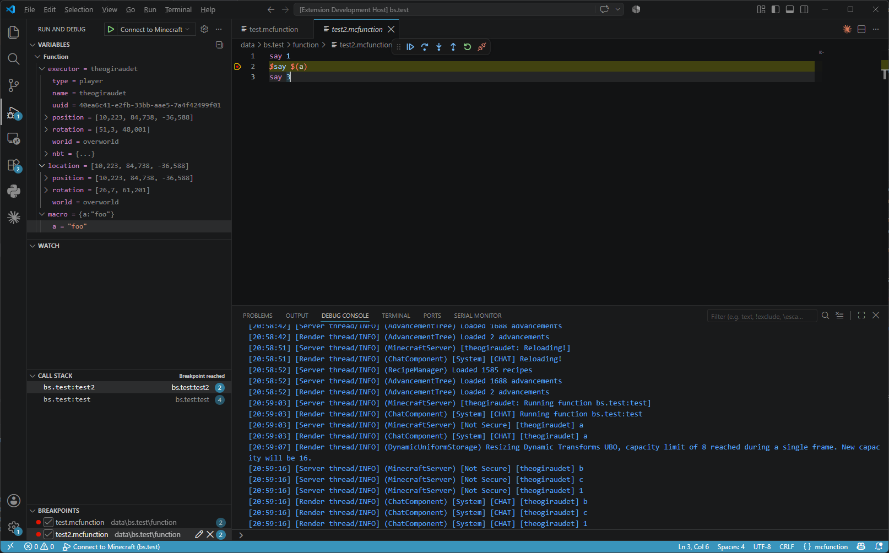

<h1 align="center">
  <picture>
    <source media="(prefers-color-scheme: light)" srcset="docs/_static/banner-light.png">
    
  </picture>
</h1>

<div align="center">
  <a href="https://github.com/mcbookshelf/sniffer/actions/workflows/test.yml"></a>
  &nbsp;
  &nbsp;
  <a href="https://discord.gg/MkXytNjmBt"></a>
</div>

<br/>

<p align="center">Sniffer turns a running Minecraft game into a debugger for your <code>.mcfunction</code> datapacks, driven from Visual Studio Code.</p>

<p align="center"></p>
<p align="center"><i>A function paused on a breakpoint, with its call stack and the game state at that point.</i></p>

Sniffer comes in two parts:

<table>
  <tr>
    <td align="center" nowrap>🧩 <b>Mod</b></td>
    <td>Runs inside Minecraft and exposes the game as a Debug Adapter Protocol server. Also adds the in game debug commands (<code>/breakpoint</code>, <code>/trace</code>, <code>#!log</code>, <code>#!assert</code>, ...) and hot reload of edited functions.</td>
  </tr>
  <tr>
    <td align="center" nowrap>🔌 <b>Extension</b></td>
    <td>Connects VS Code to a running game, so breakpoints, stepping, variable inspection and the call graph of a traced execution work in <code>.mcfunction</code> files the way they do in any other language.</td>
  </tr>
</table>

## Quickstart

Install [Fabric Loader](https://fabricmc.net/use/), then drop the Sniffer jar into your `mods` folder alongside [Fabric API](https://modrinth.com/mod/fabric-api) and [Cloth Config](https://modrinth.com/mod/cloth-config), and install the *Sniffer* extension in VS Code.

Open your datapack in VS Code and accept the notification offering to add a debug configuration:

```json
{
  "type": "sniffer",
  "request": "attach",
  "name": "Connect to Minecraft",
  "address": "ws://localhost:25599/dap"
}
```

Load your world, run *Connect to Minecraft* from the *Run and Debug* view, and accept the authorization dialog that pops up in game.
Set a breakpoint in a `.mcfunction` file, call that function with `/function`, and the execution halts before the marked command.

## Documentation

- [Quickstart](docs/quickstart.md) — install and first breakpoint
- [VS Code](docs/vscode.md) — launch configuration, debug toolbar, variables, breakpoint kinds, trace graph
- [Commands](docs/commands/index.md) — `/breakpoint`, `/trace`, `#!log`, `#!assert`, `#!watch`, ...
- [Expressions](docs/commands/expression.md) — the `{ ... }` mini language reading scores, NBT and entity names
- [Contributing](.github/CONTRIBUTING.md) — building the mod and running the tests

The pages are built with [Sphinx](https://www.sphinx-doc.org/) and published on Read the Docs.
[uv](https://docs.astral.sh/uv/) installs the tooling on first run:

```sh
uv run docs build   # HTML into docs/_build
uv run docs watch   # live reload on http://127.0.0.1:8000
```

## Acknowledgements

Sniffer is built on [Datapack Debugger](https://github.com/Alumopper/Datapack-Debugger/) by
[Alumopper](https://github.com/Alumopper), and adds the Debug Adapter Protocol layer on top of it.
